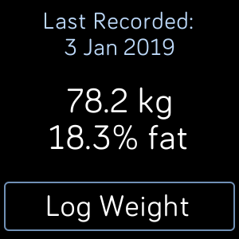
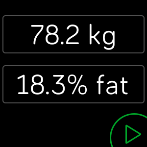
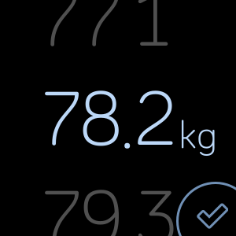
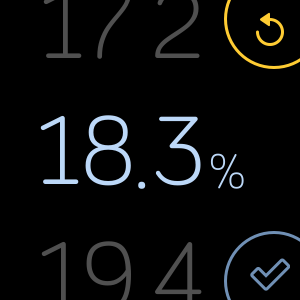
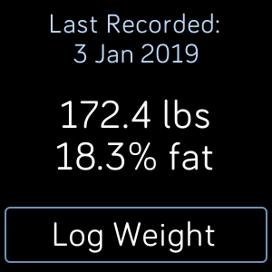
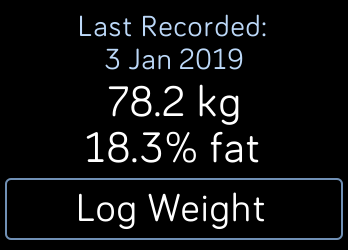
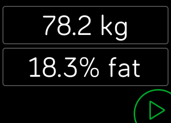
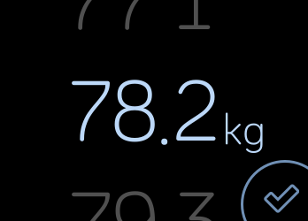
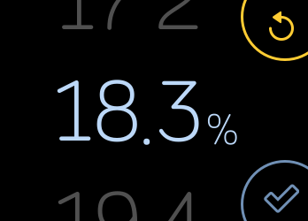
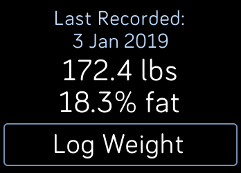

# Weight Logger

An app to log today's weight and body fat to your Fitbit profile.
+ Before first use you need to login to your Fitbit account in the settings.
+ Requires your device to be connected to your phone and an active internet connection.
+ Supports kg and lbs.
+ Body fat percentage is optional.

## Screenshots

### Versa

    

### Ionic

    

## Development

```javascript
npm install
```

### Build

```javascript
npx fitbit
fitbit$ build
fitbit$ install
```

## OAuth

+ Need to register app at <https://dev.fitbit.com/apps/new/>

## References

+ https://github.com/Fitbit/ossapps
+ Based on "Log weight" by benedicteb (<https://github.com/benedicteb/fitbit-log-weight>)
